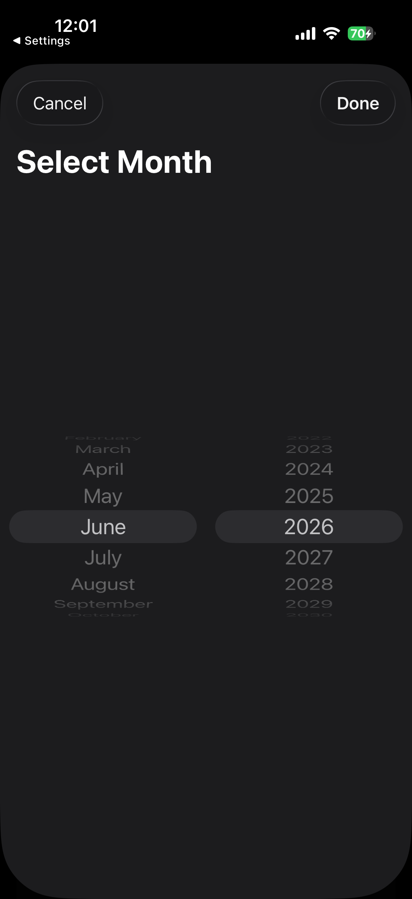
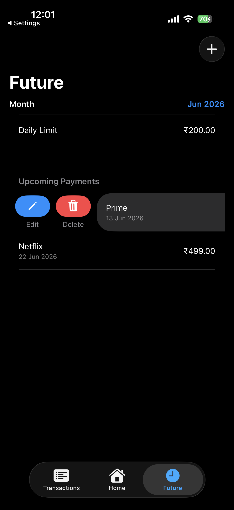

# FinanceTracker

FinanceTracker is a personal finance tracker built with SwiftUI and SwiftData. It supports income/expense tracking, presets for recurring expenses, a dashboard with charts, and future planning for limits and upcoming payments.

## Features
- Income and expense tracking by date
- Monthly selector for filtering
- Expense presets with quick add
- Dashboard with donut + bar charts
- KPI grid (monthly/yearly summaries)
- Daily limit + savings calculation
- Upcoming payments list

## Screenshots
<table>
  <tr>
    <td align="center"></td>
    <td align="center"></td>
    <td align="center"></td>
    <td align="center"></td>
  </tr>
  <tr>
    <td align="center"></td>
    <td align="center"></td>
    <td align="center"></td>
    <td align="center"></td>
  </tr>
  <tr>
    <td align="center"></td>
    <td align="center"></td>
    <td align="center"></td>
    <td align="center"></td>
  </tr>
  <tr>
    <td align="center"></td>
    <td align="center"></td>
    <td align="center"></td>
    <td align="center"></td>
  </tr>
</table>

## Tech Stack
- SwiftUI
- SwiftData
- Swift Charts

## Getting Started
1. Open `FinanceTracker.xcodeproj` in Xcode.
2. Select a simulator or device.
3. Run the app.

## Project Structure
- `FinanceTracker/` — App source
- `FinanceTracker/Assets.xcassets/` — App icons and assets
- `screenshots/` — All screenshots showcased on GitHub

## Roadmap
- Flutter + FastAPI + Postgres version (cross‑platform)
- Server‑backed sync
- Category‑based analytics
